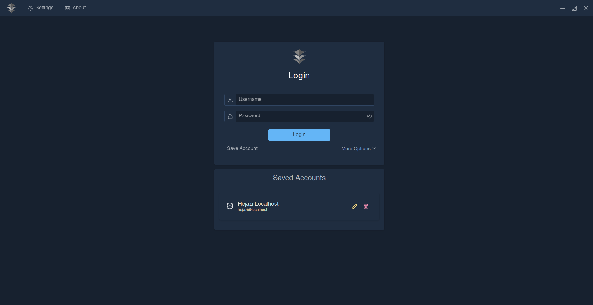
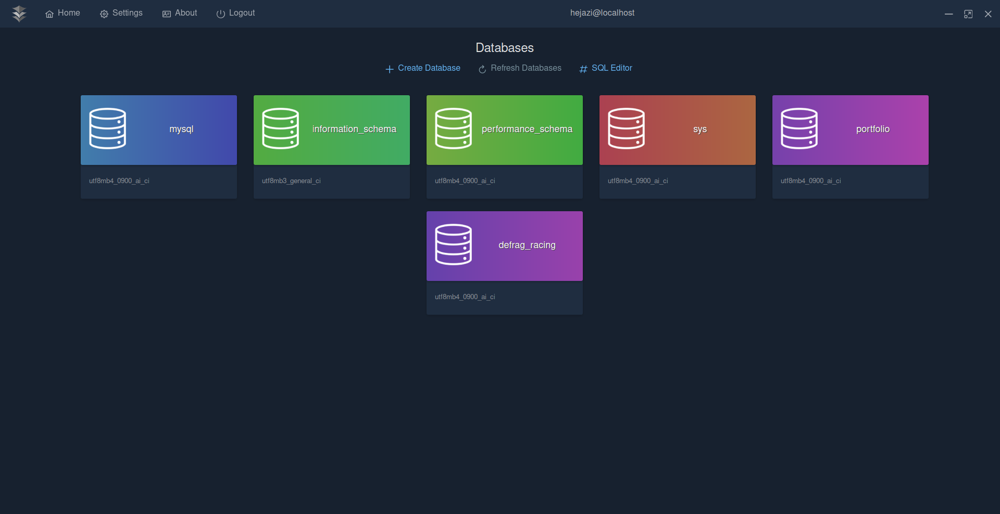
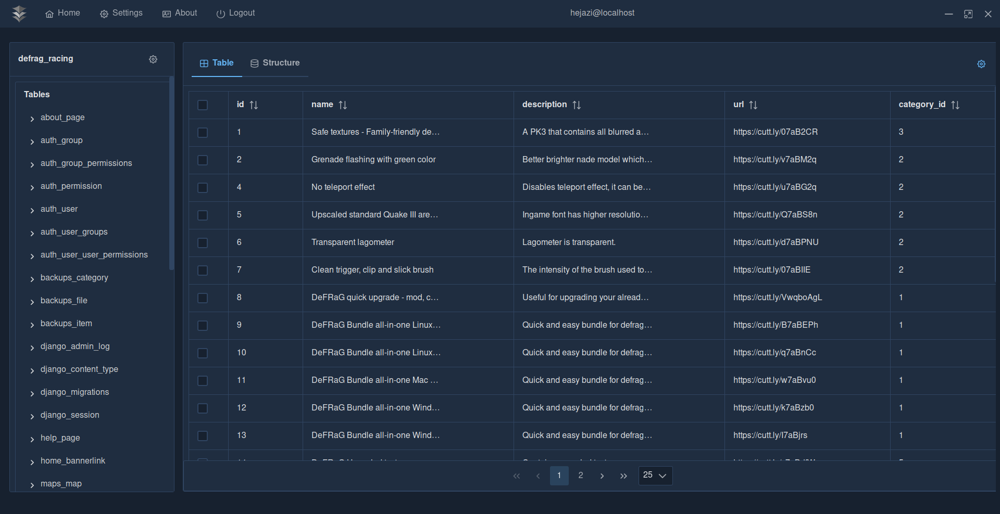

# Cleopatra DB
Cleopatra DB is cross-platform Mysql Database viewer and editor made for windows, linux, macos
Its main objective is to be a beautiful and powerful alternative to things like PHPMYADMIN


### Other images
<details>
  <summary>Click to reveal other images</summary>
  
  
  
</details>

### Stack
* Javascript
* VueJS
* PrimeVue
* Rust
* Tauri


### Install
```
git clone https://github.com/Abdullah-Hejazi/cleopatra-db
cd cleopatra-db
npm install
```

To preview the application in dev mode you can run:
```
npm run tauri dev
```

To build the executable you can run:
```
npm run tauri build
```